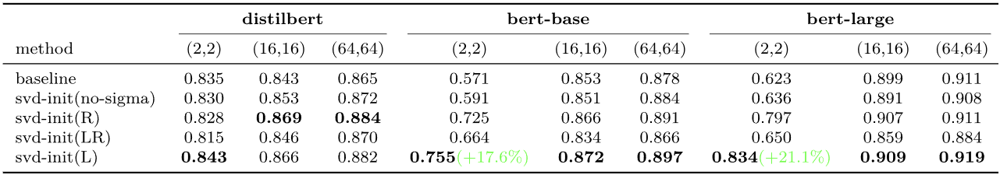

# X-LoRA: Exploring LoRA Variants from Matrix Decomposition Perspective

An experimental research project exploring different LoRA (Low-Rank Adaptation) variants based on matrix decomposition techniques.

## Overview

This project implements and compares various LoRA variants:
- **Baseline LoRA**: Standard LoRA implementation using PEFT
- **SVD-based LoRA**: LoRA initialization using Singular Value Decomposition
- **Orthogonal LoRA**: LoRA with orthogonal constraints (regularization or QR decomposition)
- **Structured LoRA**: LoRA with structured matrices (LU or Cholesky decomposition)

Results


## Project Structure

```
X-Lora/
├── src/
│   └── x_lora/
│       ├── models/              # LoRA model implementations
│       │   ├── orthogonal_lora.py
│       │   ├── structured_lora.py
│       │   └── svd_lora.py
│       ├── data/                # Data utilities
│       │   └── utils.py
│       └── train/               # Training utilities
│           ├── methods.py       # Model builders
│           └── callbacks.py     # Training callbacks
├── scripts/                     # Experiment scripts
│   ├── run_experiments.sh
│   ├── exp2.sh
│   └── ...
├── tools/                       # Utility tools
│   ├── aggregate_results.py
│   └── svd_energy_visual.py
├── configs/                     # Configuration files
├── tests/                       # Test files
├── figures/                     # Generated figures
├── train.py                     # Main training script
├── requirements.txt             # Python dependencies
└── README.md
```

## Installation

1. Clone the repository:
```bash
git clone <repository-url>
cd X-Lora
```

2. Create a virtual environment (recommended):
```bash
conda create -n x-lora python=3.10
conda activate x-lora
```

3. Install dependencies:
```bash
pip install -r requirements.txt
```

## Usage

### Training

The main training script supports multiple LoRA variants:

```bash
python train.py --method <method> --rank <rank> [options]
```

**Available methods:**
- `baseline`: Standard LoRA
- `svd`: SVD-based LoRA initialization
- `ortho`: Orthogonal LoRA
- `struct`: Structured LoRA

**Example:**
```bash
# Train with baseline LoRA
python train.py --method baseline --rank 8 --epochs 3 --batch_size 32

# Train with SVD-based LoRA
python train.py --method svd --rank 8 --svd_energy_threshold 0.9

# Train with Orthogonal LoRA
python train.py --method ortho --rank 8 --orthogonal_lambda 1e-4 --use_qr

# Train with Structured LoRA
python train.py --method struct --rank 8 --structure_type lu
```

### Running Experiments

Use the provided scripts in the `scripts/` directory:

```bash
# Run all experiments
bash scripts/run_experiments.sh

# Or run individual experiments
bash scripts/exp2.sh
```

### Visualization

Generate SVD energy visualizations:

```bash
python tools/svd_energy_visual.py
```

### Aggregating Results

After running experiments, aggregate results:

```bash
python tools/aggregate_results.py --root outputs --out outputs/summary.csv
```

## Configuration

Key hyperparameters can be configured via command-line arguments:

- `--rank`: LoRA rank (default: 8)
- `--lora_alpha`: LoRA scaling factor (default: 16)
- `--learning_rate`: Learning rate (default: 2e-5)
- `--batch_size`: Batch size (default: 32)
- `--epochs`: Number of training epochs (default: 3)

For method-specific options, see `python train.py --help`.

## Datasets

Currently configured for SST-2 sentiment classification task. The dataset is automatically downloaded when first run.

## Results

Training outputs are saved in the `outputs/` directory with:
- Model checkpoints
- Training logs
- Evaluation metrics
- Run summaries (JSON)

## Development

### Project Organization

- **Models** (`src/x_lora/models/`): Core LoRA implementations
- **Data** (`src/x_lora/data/`): Data loading and preprocessing
- **Training** (`src/x_lora/train/`): Training utilities and callbacks
- **Scripts** (`scripts/`): Experiment automation
- **Tools** (`tools/`): Analysis and visualization utilities

### Adding New LoRA Variants

1. Create a new module in `src/x_lora/models/`
2. Implement the LoRA layer class
3. Add a builder function in `src/x_lora/train/methods.py`
4. Update `train.py` to support the new method

## License

See LICENSE file for details.